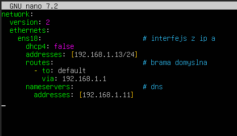

# Konfiguracja sieci w Linux (Netplan)

## Sprawdzenie interfejsu

`ip a` - pokazuje wszystkie interfejsy sieciowe

## Edycja pliku netplan

Edytujemy plik netplan za pomocą polecenia:
`sudo nano /etc/netplan/(TAB)`

* `ens18` - nazwa interfejsu wzięta z **ip a**
* `addresses: [ADRES_IP/MASKA]` - adres statyczny urządzenia
* `routes: ... via: BRAMA_DOMYSLNA` - adres bramy domyślnej
* `nameservers: ... ADRES_DNS` - adres serwera DNS

## Zatwierdzenie zmian 

`sudo netplan apply` - akceptuje zmiany wykonane w pliku

## Przydatne komendy sieciowe

* `ping [adres_IP/domena]` - sprawdza, czy docelowy host jest osiągalny.
* `traceroute [domena]` - pokazuje całą ścieżkę (wszystkie routery po drodze), jaką przebywa pakiet do celu.
* `ss -tulpn` - Pokazuje wszystkie otwarte porty i procesy, które z nich korzystają.
* `nslookup` - szybkie sprawdzenie adresu IP przypisanego do nazwy.
---
* `ip link set [interfejs] up/down` - szybkie włączenie lub wyłączenie karty sieciowej
* `ip route show` - pokazuje tablicę routingu (którędy wychodzą pakiety w świat).
