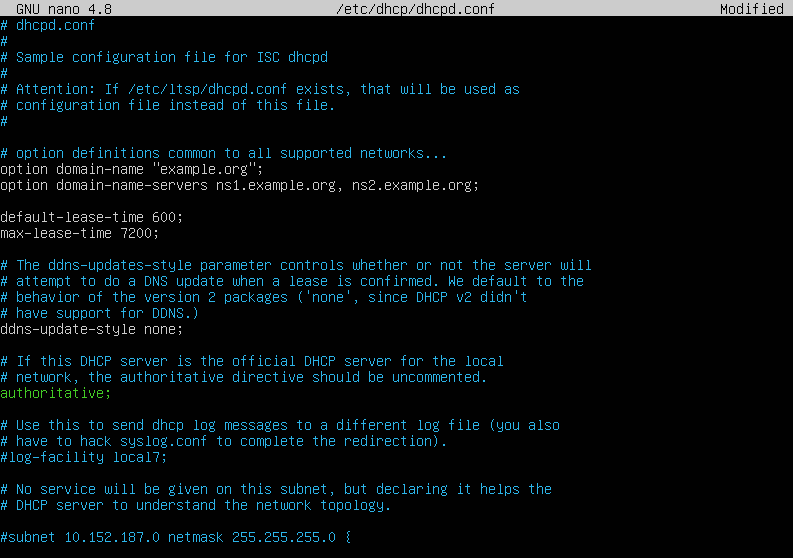
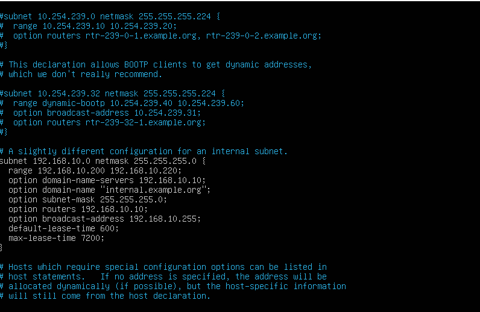
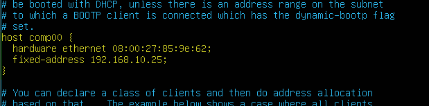

# Serwer DHCP na Linux Server

## Instalacja

`apt install isc-dhcp-server` - zainstalowanie serwisu, można z opcja `-y`

`systemctl status isc-dhcp-server` - sprawdzamy status serwera, jeżeli jest włączony to wyłączamy poniższą komendą

`systemctl stop isc-dhcp-server` - wyłączenie serwera dhcp

## Konfiguracja

Otwieramy plik **isc-dhcp-server**, by wpisać swój interfejs sieciowy. 

`nano /etc/default/isc-dhcp-server`

W odpowiednie miejsce wpisujemy nazwe swojego interfejsu sieciowego

---

Otwieramy plik **dhcpd.conf**, by skonfigurować serwer.

`nano /etc/dhcp/dhcpd.conf`

Odkomentowujemy `authoritave;`, włącza to serwer.

--- 

#### Zmieniamy zakres i ustawienia naszego serwera.

* `subnet ADRES_SIECI netmask MASKA`
    * `range 192.168.10.200 192.168.10.220` - zakres rozdawanych **adresów**
    * `option domain-name-servers ADRES` - opcja servera **DNS**
    * `option routers 192.168.10.10` - opcja **bramy domyślnej**
    * `max-lease-time 7200` - opcja maksymalnej **dzierżawy**

---

#### Ustawienie adresu hosta (jeśli wymagane)

* `host NAZWA` - nadajemy **nazwe hosta**
    * `hardware ethernet ADRES_MAC` - wpisujemy adres MAC hosta
    * `fixed-address ADRES` - wpisujemy **adres stały** dla hosta

---

#### Restartujemy i sprawdzamy na hoscie
  
``systemctl restart isc-dhcp-server``

